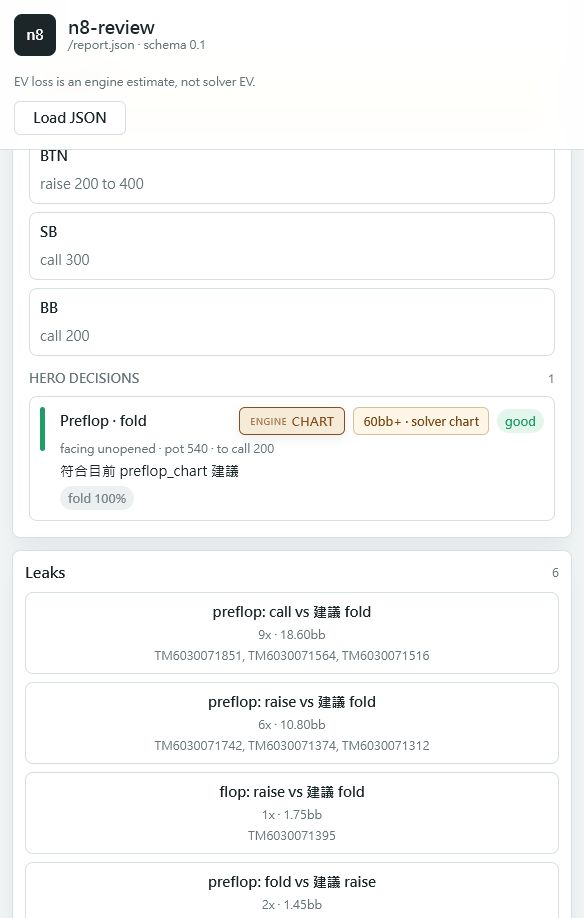

# n8-review

**English** | [繁體中文](README.md)

<p align="center">
  
  
  
  
  
  
  
  
</p>

> Review your poker hands like a chess engine — hand by hand, decision by decision, with every move graded against GTO.

**n8-review** reads hand histories exported from Natural8 / GGPoker tournaments and, from **your own (Hero) perspective**, marks each decision 🟢 fine / 🟡 inaccuracy / 🔴 mistake, with the GTO recommendation and the reasoning. After one session you know exactly which hands you misplayed, where, and how you should have played them.

<p align="center">
  
</p>

---

## ✅ Supported formats

| Source / type | Supported |
|---|---|
| **Natural8 / GGPoker tournaments (MTT)** | ✅ Yes |
| Other GG Network skins' tournaments | ✅ Usually (same hand-history format) |
| Other poker sites (PokerStars, 888, partypoker…) | ❌ Not yet (different hand-history format) |
| Cash games | ❌ Not yet (only tournament headers are parsed) |

> In short: **only Natural8 / GGPoker tournament hand histories are supported right now.** Files from other sites or cash games won't parse.

---

## ✨ Features

- **🎯 Per-decision GTO grading** — every Hero decision point is listed and colored by how much EV it loses versus GTO.
- **📊 Statistics** — GTO accuracy, EV loss per 100 hands, VPIP / PFR / 3Bet / C-bet, and net by position.
- **👥 Opponent profiling** — aggregates recurring opponents' tendencies, suggests exploits, and feeds back into postflop equity.
- **🖥️ Web UI** — interactive hand-by-hand replay. No backend, no build step, just open it.
- **🔌 Pluggable solver** — a lightweight equity/EV estimate by default; attach an external CFR solver for deep solves on key hands.

---

## 🚀 Quick start

### 1. Install

```powershell
python -m venv .venv
.venv\Scripts\activate
pip install -e .
```

### 2. Analyze your hands

Drop your n8-exported `.txt` files into a folder (see `data/` for an example), then:

```powershell
n8-review analyze ".\data" --json report.json
```

The terminal prints a colored, hand-by-hand review plus stats, and writes a `report.json`.

### 3. Explore in the Web UI

```powershell
n8-review web --report report.json
```

Open the URL printed in the terminal (default http://127.0.0.1:8765/) to replay hands, filter by position / street / result, and inspect leaks and opponent profiles.

> Don't want a server? You can also just open `web/index.html` in a browser and load `report.json` manually.

---

## 📖 Commands

| Command | What it does |
|---|---|
| `n8-review analyze <path>` | Hand-by-hand colored review + stats + leaks; add `--json report.json` to export for the Web UI |
| `n8-review hand <file> --id <hand-id>` | Deep, street-by-street review of a single hand |
| `n8-review stats <path>` | Statistics only |
| `n8-review profile <path>` | Opponent profiles (VPIP / PFR / 3Bet / tags) |
| `n8-review web --report report.json` | Start the local Web UI server |

**Common options**

```powershell
n8-review analyze ".\data" --hero "Hero"          # set the Hero name (default "Hero")
n8-review analyze ".\data" --min-tier inaccuracy  # only show inaccuracies and worse
n8-review hand ".\data\xxx.txt" --id TM6030071921 --postflop solver --solver-path C:\path\solver.exe
```

`<path>` can be a single `.txt` file or a folder full of hand-history files.

---

## 🧠 How it works

```
.txt ─▶ parse ─▶ Hero-view enrichment ─▶ per-decision GTO grading ─▶ report / Web UI
                 (position/stack/M)      ├ preflop: GTO range-chart lookup
                                         └ postflop: equity estimate (default) or CFR solver (optional)
```

- **Preflop** matches precomputed GTO range charts (per-position open / 3bet / call, short-stack push/fold) — true GTO, offline, and fast.
- **Postflop** uses equity vs the opponent range + EV heuristics to reliably flag obvious mistakes; attach an external adapter for a real solver deep-dive on key hands.

The solver adapter's JSON contract is documented in [`docs/SOLVER_ADAPTER.md`](docs/SOLVER_ADAPTER.md).

---

## 📁 Project layout

```
n8 analyze/
├── src/n8_review/      core engine
│   ├── parser/         hand-history text parsing
│   ├── enrich/         Hero-view derivation (position, effective stack, decision nodes)
│   ├── gto/            preflop GTO range charts
│   ├── evaluate/       per-decision grading + pluggable postflop backends
│   ├── analysis/       equity / stats / leak aggregation
│   ├── profile/        opponent profiling
│   └── report/         CLI colored output + JSON export
├── web/                static Web UI (SPA)
├── docs/               solver adapter contract
├── data/               example hand histories
└── tests/              tests
```

---

## 🔬 Advanced (optional): attach a real solver

**You don't need to install any solver for normal use** — the default equity backend already flags obvious mistakes.

To get a true CFR deep-solve on key hands, attach [TexasSolver](https://github.com/bupticybee/TexasSolver):

1. Download TexasSolver's `console_solver` (bundled in the Windows release — no build needed).
2. Point to it: `$env:TEXAS_SOLVER_CONSOLE = "C:\TexasSolver\console_solver.exe"`
3. Run via the bundled launcher:
   ```powershell
   n8-review hand ".\data\xxx.txt" --id TM123 --postflop solver --solver-path .\validation\texassolver.cmd
   ```

Full setup, tuning knobs, and modeling assumptions are in [`docs/SOLVER_ADAPTER.md`](docs/SOLVER_ADAPTER.md).

---

## ⚠️ About the EV estimate

Without a solver, `ev_loss_bb` is an engine **estimate** (from chart / equity heuristics). Treat it as **severity guidance**, not exact solver EV. For precise numbers, run that hand with `--postflop solver` and a solver adapter.

---

## 🛠️ Development

```powershell
pip install -e ".[dev]"   # install dev deps (pytest / ruff / mypy)
pytest                    # tests
ruff check src tests      # lint
mypy src                  # type check
```

Requires Python 3.11+.

---

## 🤝 Contributing

Issues and PRs welcome! A few notes before you submit, to keep reviews smooth:

**Before you start**

- For larger changes, **open an issue first** to align on direction before implementing.

**While coding** (see [`CLAUDE.md`](CLAUDE.md))

- **Keep it simple** — minimum code that solves the problem; no abstractions or configurability that weren't asked for.
- **Surgical changes** — touch only what you must; don't refactor or reformat adjacent code; match the existing style.
- **Don't break the parser's tolerance rule** — known tokens are parsed strictly; unknown lines go to `raw_unparsed` as a warning without aborting.
- Comments may be in **English or Chinese** — just match the surrounding style.

**Before you submit**

```powershell
pytest                 # tests must be green
ruff check src tests   # lint must pass
mypy src               # type check (strict) must pass
```

- When changing grading, parsing, or export logic, add a test that reproduces/verifies the change.
- Keep each PR focused on one thing; write commit messages that explain *what* changed and *why*.

> Note: edit `CLAUDE.md` only — `AGENTS.md` is auto-synced from it by a hook.

---

## 📌 Status

The core path (M1–M7) is implemented: parsing, Hero-view enrichment, equity backend, preflop grading, stats / leaks / profiling, JSON export, Web UI, and the optional external solver adapter.

---

## 📄 License

MIT License — see [`LICENSE`](LICENSE).
