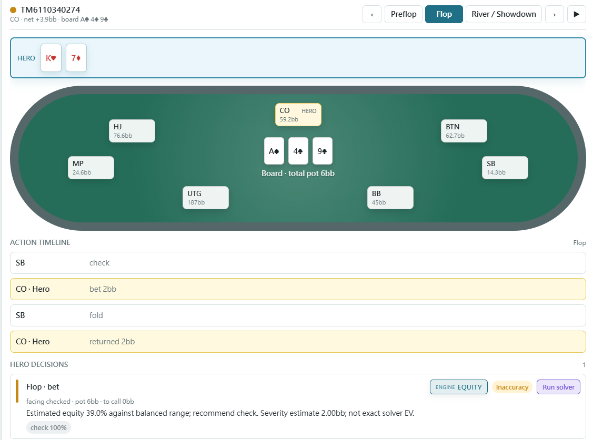
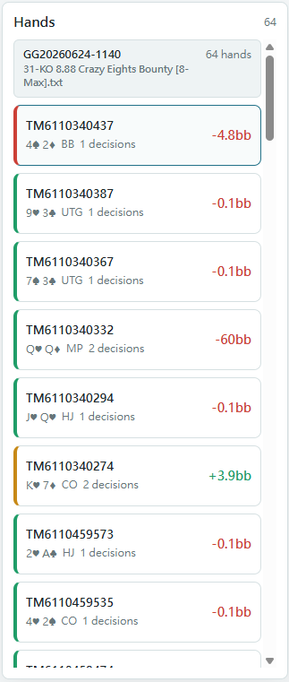
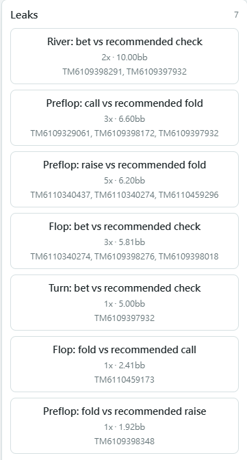
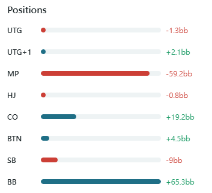

# poker-hand-review

[English](../../README.md) | [繁體中文](README.zh-TW.md) | **简体中文**

<p align="center">
  <a href="https://github.com/matthiola0/poker-hand-review/actions/workflows/ci.yml"></a>
  
  
  
  
  
  
  
  
</p>

> 逐手、逐决策复盘扑克手牌，用图表与胜率估算找出值得优先研究的局面。

**poker-hand-review** 读取 Natural8 / GGPoker 锦标赛导出的手牌历史，从 **你本人（Hero）** 的视角，将决策与翻前图表、翻后估算比较，并标色 🟢 低偏差 / 🟡 值得复查 / 🔴 优先复查，附上建议动作与理由，帮助安排后续研究顺序。

<p align="center">
  
</p>

---

## 目录

- [这是什么](#这是什么)
- [支持范围](#支持范围)
- [快速开始](#快速开始)
  - [安装](#安装)
  - [运行](#运行)
- [命令与选项](#命令与选项)
- [界面导览](#界面导览)
- [工作原理](#工作原理)
- [进阶：接真 solver](#进阶接真-solver)
- [项目结构](#项目结构)
- [开发](#开发)
- [贡献](#贡献)
- [状态与路线图](#状态与路线图)
- [许可](#许可)

---

## 这是什么

poker-hand-review 把一整个文件夹的原始手牌历史 `.txt` 转成可标注颜色、可浏览的复盘 —— 就像国际象棋引擎逐步标注一盘棋。

- **逐决策复盘。** 每手抽出 Hero 的决策点，依严重度估算标色，安排复盘优先顺序。
- **统计报表。** 低偏差决策比例、每百手严重度估算、VPIP / PFR / 3Bet / C-bet，以及各位置净利。
- **对手画像。** 聚合重复对手的倾向、产生剥削建议，并把假设范围回馈给翻后 equity 计算。
- **交互式 Web UI。** 逐街回放任一手、按位置／街／结果筛选，并深入漏洞与对手画像。
- **可插拔翻后引擎。** 默认用快速的 equity/EV 估计；关键手可接外部 CFR solver 做真正的深解。

> [!NOTE]
> 视角永远是 **Hero（你）**。本工具评的是*你的*决策，不是整桌的。用 `--hero` 指定谁是 Hero（默认 `Hero`）。

---

## 支持范围

| 来源 / 类型 | 支持 |
|---|---|
| Natural8 / GGPoker 锦标赛（MTT） | 支持 |
| 其他 GG 网络 skin 的锦标赛 | 多半可用 —— 同一套手牌历史格式 |
| 其他扑克室（PokerStars、888、partypoker…） | 尚未支持 —— 手牌历史格式不同 |
| 现金局（cash game） | 尚未支持 —— 目前只解析锦标赛标头 |

> [!IMPORTANT]
> 目前**只支持 Natural8 / GGPoker 的锦标赛**手牌历史。其他扑克室或现金局的文件会解析不到。

解析器刻意保持容忍：已知 token 严格解析，但任何无法识别的行会记成警告（`raw_unparsed`），而不是让整个文件中断。

---

## 快速开始

### 安装

```powershell
python -m venv .venv
.venv\Scripts\activate
pip install -e .
```

需求为 Python 3.11 以上。以下命令使用 PowerShell 语法（Windows）。

### 运行

poker-hand-review 可以完全在浏览器操作，也可以走命令行。两条路径跑的是同一套引擎、产出同样的复盘；依你一次要分析的量择一即可 —— 它们是替代方案，不是先后步骤。

| | 浏览器 | 命令行 |
|---|---|---|
| 适用场景 | 查看单一文件 | 批量分析整个文件夹 |
| 每次输入 | 一个 `.txt` | 整个文件夹的 `.txt` |
| 终端逐手复盘 | — | 有 |
| 保存结果 | `data/analyzed/` 逐文件缓存 | `report.json`（可日后重新加载） |

**浏览器** —— 上传即分析，无需另跑 `analyze`：

```powershell
poker-hand-review web
```

打开打印的网址（默认 <http://127.0.0.1:8765/>），点 **Load txt / json** 并选一个 `.txt`。本地 server 会解析、评分并渲染复盘，将逐文件 JSON 缓存写到 `data/analyzed/`。后端下拉菜单（**Equity** / **Solver**）选择翻后分析方式；solver 路径须在启动 server 时以 `--solver-path` 设置。

缓存只在原文、Hero、后端、分析版本、图表内容与分析设置相符时复用；相关 solver 设置或 adapter 文件变更也会使其失效。旧格式缓存会在下次分析时重建，`refresh` 可强制重算。报告的 `analysis` 记录初次分析设置，个别决策则标示已保存的 solver 复查结果。

**命令行** —— 先把整个文件夹分析好，再开报表：

```powershell
poker-hand-review analyze ".\data" --json report.json
poker-hand-review web --report report.json
```

`analyze` 会在终端打印彩色的逐手复盘并写出 `report.json`；`web --report` 则在浏览器打开该报表。这条路径一次处理整个文件夹，并留下一份可重复加载的 `report.json`。

> [!TIP]
> 还没有自己的手牌？repo 内附合成示例 `data/sample.txt`：
> ```powershell
> poker-hand-review analyze data/sample.txt
> ```

不论走哪条路，报表打开后都能逐手回放、按位置／街／结果筛选，并深入漏洞与对手画像。

> [!NOTE]
> `.json` 报表也可以不开 server 直接看 —— 打开 `web/index.html` 再手动加载文件即可。但分析 `.txt` 一定需要 server，因为解析与评分跑在 Python。

---

## 命令与选项

| 命令 | 用途 |
|---|---|
| `poker-hand-review analyze <路径>` | 逐手彩色复盘 + 统计 + 漏洞 |
| `poker-hand-review hand <文件> --id <手牌ID>` | 单手逐街深度复盘 |
| `poker-hand-review stats <路径>` | 只看统计指标 |
| `poker-hand-review profile <路径>` | 对手画像（VPIP / PFR / 3Bet / 标签） |
| `poker-hand-review web` | 启动 Web UI 本地 server |

`<路径>` 可以是单一 `.txt` 文件，也可以是装满手牌文件的文件夹。

**`analyze` 选项**

| 选项 | 用途 | 示例 |
|---|---|---|
| `--json <文件>` | 一并导出 Web UI 用的 JSON 报表 | `--json report.json` |
| `--hero <名称>` | 指定 Hero（你）的名称；默认 `Hero` | `--hero "YourName"` |
| `--min-tier <等级>` | 只显示此等级或更差：`good` / `inaccuracy` / `mistake` | `--min-tier inaccuracy` |
| `--postflop <后端>` | 翻后引擎：`equity`（默认）或 `solver` | `--postflop solver` |
| `--solver-path <路径>` | 外部 solver adapter 路径（搭配 `--postflop solver`） | `--solver-path .\validation\texassolver.cmd` |
| `--no-color` | 关闭终端 ANSI 色彩输出 | `--no-color` |

**`web` 选项**

| 选项 | 用途 | 默认 |
|---|---|---|
| `--report <文件>` | 启动时预先加载 JSON 报表 | 无 |
| `--solver-path <路径>` | 启用 UI 内的 solver 后端 | 无（仅 equity） |
| `--host` / `--port` | 绑定地址 | `127.0.0.1` / `8765` |

```powershell
# 几个常用写法
poker-hand-review analyze ".\data" --hero "Hero"
poker-hand-review analyze ".\data" --min-tier inaccuracy
poker-hand-review hand ".\data\xxx.txt" --id TM6030071921 --postflop solver --solver-path C:\path\solver.exe
```

---

## 界面导览

快速看懂 Web UI。最上方的动画演示完整界面操作；点任一张可放大。

<table>
<tr>
<td colspan="3" align="center"><b>逐手回放 Hand replay</b><br><sub>牌桌＋动作时间轴＋决策评分卡（GTO／solver 建议）</sub></td>
</tr>
<tr valign="top">
<td colspan="3" align="center"></td>
</tr>
<tr valign="top">
<td width="33%" align="center"><b>手牌列表 Hand list</b><br><sub>逐手 ID／底牌／位置／净利，依最严重失误标注颜色</sub></td>
<td width="33%" align="center"><b>漏洞 Leaks</b><br><sub>重复复查模式：次数、累计严重度估算、对应手牌</sub></td>
<td width="33%" align="center"><b>各位置盈亏 Net by position</b><br><sub>各位置净输赢，看哪个位置在漏钱</sub></td>
</tr>
<tr valign="top">
<td align="center"></td>
<td align="center"></td>
<td align="center"></td>
</tr>
</table>

---

## 工作原理

```
.txt ─▶ 解析 ─▶ Hero 视角衍生 ─▶ 逐决策 GTO 评分 ─▶ 报表 / Web UI
                （位置/筹码/M）   ├ 翻前：GTO 范围表查表
                                 └ 翻后：equity 估计（默认）或 CFR solver（选用）
```

- **翻前**比对预存的 **8-max MTT** 四动作范围表（raise / all-in / call / fold），一般加注与全押分开评分。≥5% 的接受门槛是评分启发法，不是动作 EV 计算。筹码分桶与位置映射近似实际局面；除一般加注与全押的区别外，不评估下注尺寸。
- **翻后**估算对手假设范围的 equity，据此安排复盘顺序。Equity 后端的动作权重是启发式建议，不是 GTO 混合频率。外部 adapter 可提供模型局面的 solver 策略；随附 TexasSolver adapter 假设 Hero 有位置，使用预设对手范围与简化尺寸，限制详见其文档。

Solver adapter 是一支独立进程，通过有文档记载的 JSON 契约通信 —— 见 [`docs/SOLVER_ADAPTER.md`](../SOLVER_ADAPTER.md)。

> [!WARNING]
> `ev_loss_bb` 为维持 JSON 兼容性而保留名称，代表**严重度估算**，使用 solver 时也相同。目前 adapter 契约只返回策略频率，未提供各动作 EV。已评分决策的 `ev_loss_kind` 为 `heuristic_severity`，未评分为 `unavailable`。零代表未被启发法扣分，不代表实测 EV 损失为零。`gto_accuracy` 是已评分决策中的绿灯比例；`ev_loss_per_100` 累加的是严重度估算。

---

## 进阶：接真 solver

**一般使用不需要 solver** —— 默认的 equity 后端就能标出明显失误。只有当你想对特定手做真正的 CFR 深解时才需要接 solver。

<details>
<summary><b>设置 TexasSolver（Windows，免编译）</b></summary>

<br>

poker-hand-review 内附 [TexasSolver](https://github.com/bupticybee/TexasSolver) 的 adapter：

1. 下载 TexasSolver 的 `console_solver`（Windows 发布包已内含，免自行编译）。
2. 把 adapter 指向它：
   ```powershell
   $env:TEXAS_SOLVER_CONSOLE = "C:\TexasSolver\console_solver.exe"
   ```
3. 用内置启动器跑一手：
   ```powershell
   poker-hand-review hand ".\data\xxx.txt" --id TM123 --postflop solver --solver-path .\validation\texassolver.cmd
   ```

若想在 Web UI 内启用 solver，启动 server 时加上 `--solver-path`，再于加载 `.txt` 时选 **Solver**，或针对个别决策执行 solver 复查。

</details>

<details>
<summary><b>Solver 环境变量</b></summary>

<br>

| 变量 | 用途 | 默认 |
|---|---|---|
| `TEXAS_SOLVER_CONSOLE` | TexasSolver `console_solver(.exe)` 路径 | 必填 |
| `PHR_SOLVER_PATH` / `TEXAS_SOLVER_PATH` | 默认 adapter 路径，可取代 `--solver-path` | 未设 |
| `PHR_SOLVER_THREADS` | CFR 线程数 | `8` |
| `PHR_SOLVER_ACCURACY` | 可剥削度目标（占底池 %） | `0.5` |
| `PHR_SOLVER_MAX_ITER` | CFR 最大迭代次数 | `150` |
| `PHR_SOLVER_TIMEOUT` | 单次求解超时（秒） | `300` |

</details>

完整设置、调校参数与模型假设见 [`docs/SOLVER_ADAPTER.md`](../SOLVER_ADAPTER.md)。

---

## 项目结构

```
poker-hand-review/
├── src/poker_hand_review/      核心引擎
│   ├── parser/         手牌历史文本解析
│   ├── enrich/         Hero 视角衍生（位置、有效筹码、决策节点）
│   ├── gto/            翻前 GTO 范围表（8-max MTT，四动作）
│   ├── evaluate/       逐决策评分 + 可插拔翻后后端
│   ├── analysis/       equity / 统计 / 漏洞聚合
│   ├── profile/        对手画像
│   └── report/         CLI 彩色输出 + JSON 导出
├── web/                静态 Web UI（SPA）+ 本地 server endpoint
├── docs/               solver adapter 契约文档 + 翻译
├── data/               示例手牌历史
├── tools/              TexasSolver adapter；翻前范围表导入脚本
└── tests/              测试
```

---

## 开发

```powershell
pip install -e ".[dev]"   # 安装开发依赖（pytest / ruff / mypy）
pytest                    # 测试
ruff check src tests      # lint（行长 100）
mypy src                  # 类型检查（strict）
```

需求：Python 3.11+。

---

## 贡献

欢迎 issue 与 PR。提交前请先读过这几点，能让 review 更顺：

**动手前**

- 较大的改动建议先开 issue 对齐方向，再动手实现。

**写代码时**（详见 [`CLAUDE.md`](../../CLAUDE.md)）

- **保持简单** —— 用最少的代码解决问题，不做没被要求的抽象或配置弹性。
- **外科手术式修改** —— 只动你必须动的，不顺手重构或重排相邻代码；配合既有风格。
- **遵守解析器的容忍原则** —— 已知 token 严格解析；未知行进 `raw_unparsed` 警告但不中断。
- 注释中英文皆可，配合周围既有风格即可。

**提交前**

```powershell
pytest                 # 测试要绿
ruff check src tests   # lint 要过
mypy src               # 类型检查（strict）要过
```

- 改到评分、解析或导出逻辑时，顺手补一个能复现／验证的测试。
- 一个 PR 专注一件事；commit 信息写清楚「改了什么、为什么」。

> [!NOTE]
> 请只编辑 `CLAUDE.md`，`AGENTS.md` 会由 hook 自动同步。

---

## 状态与路线图

核心流程（M1–M7）已完成：解析、Hero 视角衍生、equity 后端、翻前评分、统计 / 漏洞 / 画像、JSON 导出、Web UI，以及选用的外部 solver adapter。

尚未支持：GG 网络以外的扑克室，以及现金局格式。

---

## 许可

MIT License —— 详见 [`LICENSE`](../../LICENSE)。
