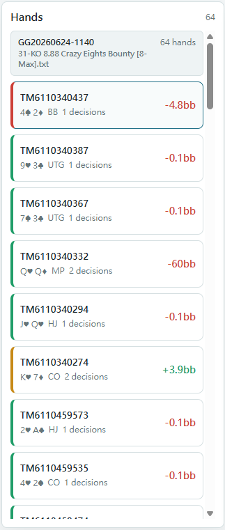
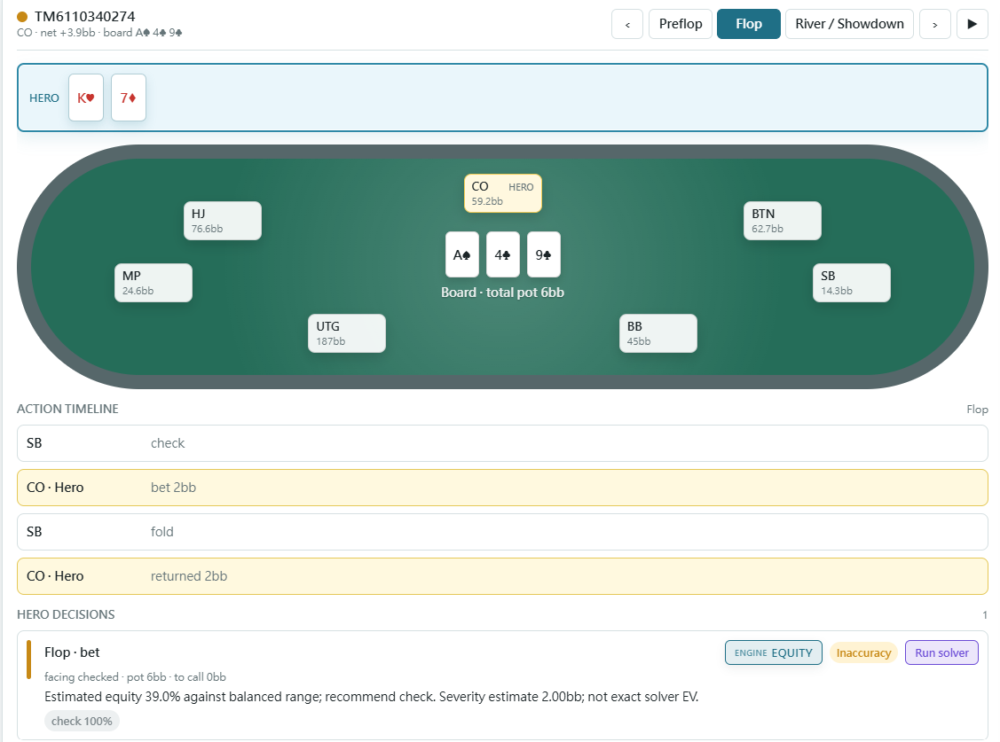
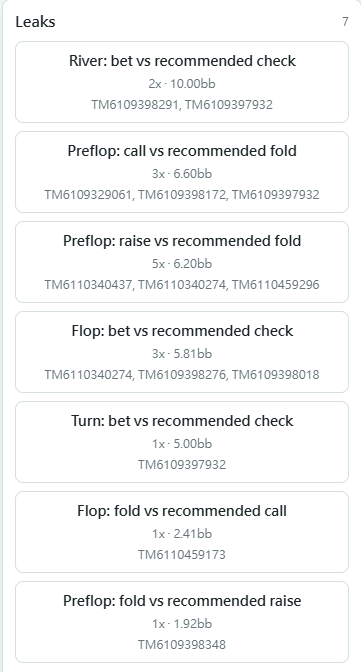
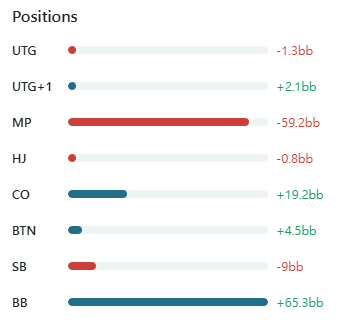

# poker-hand-review

[English](../../README.md) | **繁體中文** | [简体中文](README.zh-CN.md)

<p align="center">
  <a href="https://github.com/matthiola0/poker-hand-review/actions/workflows/ci.yml"></a>
  
  
  
  
  
  
  
  
</p>

> 像西洋棋引擎一樣檢討你的撲克手牌 —— 逐手、逐決策，用 GTO 為你的每一步上色。

**poker-hand-review** 讀取 Natural8 / GGPoker 錦標賽匯出的手牌歷史，從 **你本人（Hero）** 的視角，把每個決策對照 GTO 評分並上色 🟢 可接受 / 🟡 不準 / 🔴 失誤，並附上建議動作與背後理由。看完一場，你會清楚知道「我哪幾手打錯、錯在哪、該怎麼打」。

<p align="center">
  
</p>

---

## 目錄

- [這是什麼](#這是什麼)
- [支援範圍](#支援範圍)
- [快速開始](#快速開始)
  - [安裝](#安裝)
  - [執行](#執行)
- [指令與選項](#指令與選項)
- [畫面導覽](#畫面導覽)
- [運作原理](#運作原理)
- [進階：接真 solver](#進階接真-solver)
- [專案結構](#專案結構)
- [開發](#開發)
- [貢獻](#貢獻)
- [狀態與路線圖](#狀態與路線圖)
- [授權](#授權)

---

## 這是什麼

poker-hand-review 把一整個資料夾的原始手牌歷史 `.txt` 轉成可上色、可瀏覽的檢討 —— 就像西洋棋引擎逐步標註一盤棋。

- **逐決策 GTO 評分。** 每手抽出 Hero 的每個決策點，依偏離 GTO 的 EV 損失上色，失誤一眼可見。
- **統計報表。** GTO 準確率、每百手 EV 損失、VPIP / PFR / 3Bet / C-bet，以及各位置淨利。
- **對手群像。** 聚合重複對手的傾向、產生剝削建議，並把假設範圍回饋給翻後 equity 計算。
- **互動式 Web UI。** 逐街回放任一手、依位置／街段／結果篩選，並深入漏洞與對手群像。
- **可插拔翻後引擎。** 預設用快速的 equity/EV 估計；關鍵手可接外部 CFR solver 做真正的深解。

> [!NOTE]
> 視角永遠是 **Hero（你）**。本工具評的是*你的*決策，不是整桌的。用 `--hero` 指定誰是 Hero（預設 `Hero`）。

---

## 支援範圍

| 來源 / 類型 | 支援 |
|---|---|
| Natural8 / GGPoker 錦標賽（MTT） | 支援 |
| 其他 GG 網路 skin 的錦標賽 | 多半可用 —— 同一套手牌歷史格式 |
| 其他撲克室（PokerStars、888、partypoker…） | 尚未支援 —— 手牌歷史格式不同 |
| 現金局（cash game） | 尚未支援 —— 目前只解析錦標賽標頭 |

> [!IMPORTANT]
> 目前**只支援 Natural8 / GGPoker 的錦標賽**手牌歷史。其他撲克室或現金局的檔案會解析不到。

解析器刻意保持容忍：已知 token 嚴格解析，但任何無法辨識的行會記成警告（`raw_unparsed`），而不是讓整個檔案中斷。

---

## 快速開始

### 安裝

```powershell
python -m venv .venv
.venv\Scripts\activate
pip install -e .
```

需求為 Python 3.11 以上。以下指令使用 PowerShell 語法（Windows）。

### 執行

poker-hand-review 可以完全在瀏覽器操作，也可以走命令列。兩條路徑跑的是同一套引擎、產出同樣的檢討；依你一次要分析的量擇一即可 —— 它們是替代方案，不是先後步驟。

| | 瀏覽器 | 命令列 |
|---|---|---|
| 適用情境 | 檢視單一檔案 | 批次分析整個資料夾 |
| 每次輸入 | 一個 `.txt` | 整個資料夾的 `.txt` |
| 終端機逐手檢討 | — | 有 |
| 產生 `report.json` | 否 | 是（可日後重新載入） |

**瀏覽器** —— 上傳即分析，不需另跑 `analyze`：

```powershell
poker-hand-review web
```

打開印出的網址（預設 <http://127.0.0.1:8765/>），按 **Load txt / json** 並選一個 `.txt`。本機 server 會當場解析與評分並渲染檢討，過程不寫任何檔案。後端下拉選單（**Equity** / **Solver**）與 solver 路徑欄位用來控制翻後如何評分。

**命令列** —— 先把整個資料夾分析好，再開報表：

```powershell
poker-hand-review analyze ".\data" --json report.json
poker-hand-review web --report report.json
```

`analyze` 會在終端機印出彩色的逐手檢討並寫出 `report.json`；`web --report` 則在瀏覽器打開該報表。這條路徑一次處理整個資料夾，並留下一份可重複載入的 `report.json`。

> [!TIP]
> 還沒有自己的手牌？repo 內附合成範例 `data/sample.txt`：
> ```powershell
> poker-hand-review analyze data/sample.txt
> ```

不論走哪條路，報表開啟後都能逐手回放、依位置／街段／結果篩選，並深入漏洞與對手群像。

> [!NOTE]
> `.json` 報表也可以不開 server 直接看 —— 打開 `web/index.html` 再手動載入檔案即可。但分析 `.txt` 一定需要 server，因為解析與評分跑在 Python。

---

## 指令與選項

| 指令 | 用途 |
|---|---|
| `poker-hand-review analyze <路徑>` | 逐手彩色檢討 + 統計 + 漏洞 |
| `poker-hand-review hand <檔> --id <手牌ID>` | 單手逐街深度檢討 |
| `poker-hand-review stats <路徑>` | 只看統計指標 |
| `poker-hand-review profile <路徑>` | 對手群像（VPIP / PFR / 3Bet / 標籤） |
| `poker-hand-review web` | 啟動 Web UI 本機 server |

`<路徑>` 可以是單一 `.txt` 檔，也可以是裝滿手牌檔的資料夾。

**`analyze` 選項**

| 選項 | 用途 | 範例 |
|---|---|---|
| `--json <檔>` | 一併匯出 Web UI 用的 JSON 報表 | `--json report.json` |
| `--hero <名稱>` | 指定 Hero（你）的名稱；預設 `Hero` | `--hero "YourName"` |
| `--min-tier <等級>` | 只顯示此等級或更差：`good` / `inaccuracy` / `mistake` | `--min-tier inaccuracy` |
| `--postflop <後端>` | 翻後引擎：`equity`（預設）或 `solver` | `--postflop solver` |
| `--solver-path <路徑>` | 外部 solver adapter 路徑（搭配 `--postflop solver`） | `--solver-path .\validation\texassolver.cmd` |
| `--no-color` | 關閉終端機 ANSI 色彩輸出 | `--no-color` |

**`web` 選項**

| 選項 | 用途 | 預設 |
|---|---|---|
| `--report <檔>` | 啟動時預先載入 JSON 報表 | 無 |
| `--solver-path <路徑>` | 啟用 UI 內的 solver 後端 | 無（僅 equity） |
| `--host` / `--port` | 綁定位址 | `127.0.0.1` / `8765` |

```powershell
# 幾個常用寫法
poker-hand-review analyze ".\data" --hero "Hero"
poker-hand-review analyze ".\data" --min-tier inaccuracy
poker-hand-review hand ".\data\xxx.txt" --id TM6030071921 --postflop solver --solver-path C:\path\solver.exe
```

---

## 畫面導覽

快速看懂 Web UI。最上方主圖是完整介面總覽；點任一張可放大。

<table>
<tr>
<td width="50%" align="center"><b>1. 手牌列表 Hand list</b><br><sub>逐手 ID／底牌／位置／淨利，依最嚴重失誤上色</sub><br></td>
<td width="50%" align="center"><b>2. 逐手回放 Hand replay</b><br><sub>牌桌＋動作時間軸＋決策評分卡（GTO／solver 建議）</sub><br></td>
</tr>
<tr>
<td width="50%" align="center"><b>3. 漏洞 Leaks</b><br><sub>重複失誤模式：次數、累計 EV 損失、對應手牌</sub><br></td>
<td width="50%" align="center"><b>4. 各位置盈虧 Positions</b><br><sub>各位置淨輸贏，看哪個位置在漏錢</sub><br></td>
</tr>
</table>

---

## 運作原理

```
.txt ─▶ 解析 ─▶ Hero 視角衍生 ─▶ 逐決策 GTO 評分 ─▶ 報表 / Web UI
                （位置/籌碼/M）   ├ 翻前：GTO 範圍表查表
                                 └ 翻後：equity 估計（預設）或 CFR solver（選用）
```

- **翻前**比對預存的 GTO 範圍表（各位置 open / 3bet / call，以及短籌碼 push/fold），是真正的 GTO、離線又快。
- **翻後**計算對手假設範圍的 equity 並套用 EV 啟發法，可靠標出明顯失誤。想對在意的手以真 solver 取代啟發法，再接上外部 adapter。

Solver adapter 是一支獨立行程，透過有文件記載的 JSON 契約溝通 —— 見 [`docs/SOLVER_ADAPTER.md`](../SOLVER_ADAPTER.md)。

> [!WARNING]
> 未使用 solver 時，`ev_loss_bb` 是引擎的**估計值**（來自圖表 / equity 啟發法）。請當作**嚴重度指引**，不是精確的 solver EV。要精確數字，請對該手以 `--postflop solver` 接上 solver adapter 重跑。

---

## 進階：接真 solver

**一般使用不需要 solver** —— 預設的 equity 後端就能標出明顯失誤。只有當你想對特定手做真正的 CFR 深解時才需要接 solver。

<details>
<summary><b>設定 TexasSolver（Windows，免編譯）</b></summary>

<br>

poker-hand-review 內附 [TexasSolver](https://github.com/bupticybee/TexasSolver) 的 adapter：

1. 下載 TexasSolver 的 `console_solver`（Windows 釋出包已內含，免自行編譯）。
2. 把 adapter 指向它：
   ```powershell
   $env:TEXAS_SOLVER_CONSOLE = "C:\TexasSolver\console_solver.exe"
   ```
3. 用內建啟動器跑一手：
   ```powershell
   poker-hand-review hand ".\data\xxx.txt" --id TM123 --postflop solver --solver-path .\validation\texassolver.cmd
   ```

若想改在 Web UI 內啟用 solver，啟動 server 時加上 `--solver-path`，或在載入 `.txt` 時選 **Solver** 並填入路徑欄位。

</details>

<details>
<summary><b>Solver 環境變數</b></summary>

<br>

| 變數 | 用途 | 預設 |
|---|---|---|
| `TEXAS_SOLVER_CONSOLE` | TexasSolver `console_solver(.exe)` 路徑 | 必填 |
| `PHR_SOLVER_PATH` / `TEXAS_SOLVER_PATH` | 預設 adapter 路徑，可取代 `--solver-path` | 未設 |
| `PHR_SOLVER_THREADS` | CFR 執行緒數 | `8` |
| `PHR_SOLVER_ACCURACY` | 可剝削度目標（佔底池 %） | `0.5` |
| `PHR_SOLVER_MAX_ITER` | CFR 最大迭代次數 | `150` |
| `PHR_SOLVER_TIMEOUT` | 單次求解逾時（秒） | `300` |

</details>

完整設定、調校參數與模型假設見 [`docs/SOLVER_ADAPTER.md`](../SOLVER_ADAPTER.md)。

---

## 專案結構

```
poker-hand-review/
├── src/poker_hand_review/      核心引擎
│   ├── parser/         手牌歷史文字解析
│   ├── enrich/         Hero 視角衍生（位置、有效籌碼、決策節點）
│   ├── gto/            翻前 GTO 範圍表
│   ├── evaluate/       逐決策評分 + 可插拔翻後後端
│   ├── analysis/       equity / 統計 / 漏洞聚合
│   ├── profile/        對手群像
│   └── report/         CLI 彩色輸出 + JSON 匯出
├── web/                靜態 Web UI（SPA）+ 本機 server endpoint
├── docs/               solver adapter 契約文件 + 翻譯
├── data/               範例手牌歷史
├── tools/              TexasSolver adapter 與範圍表匯入腳本
└── tests/              測試
```

---

## 開發

```powershell
pip install -e ".[dev]"   # 安裝開發相依（pytest / ruff / mypy）
pytest                    # 測試
ruff check src tests      # lint（行長 100）
mypy src                  # 型別檢查（strict）
```

需求：Python 3.11+。

---

## 貢獻

歡迎 issue 與 PR。送出前請先讀過這幾點，能讓 review 更順：

**動手前**

- 較大的改動建議先開 issue 對齊方向，再動手實作。

**寫程式時**（詳見 [`CLAUDE.md`](../../CLAUDE.md)）

- **保持簡單** —— 用最少的程式碼解決問題，不做沒被要求的抽象或設定彈性。
- **外科手術式修改** —— 只動你必須動的，不順手重構或重排相鄰程式碼；配合既有風格。
- **遵守解析器的容忍原則** —— 已知 token 嚴格解析；未知行進 `raw_unparsed` 警告但不中斷。
- 註解中英文皆可，配合周圍既有風格即可。

**送出前**

```powershell
pytest                 # 測試要綠
ruff check src tests   # lint 要過
mypy src               # 型別檢查（strict）要過
```

- 改到評分、解析或匯出邏輯時，順手補一個能重現／驗證的測試。
- 一個 PR 專注一件事；commit 訊息寫清楚「改了什麼、為什麼」。

> [!NOTE]
> 請只編輯 `CLAUDE.md`，`AGENTS.md` 會由 hook 自動同步。

---

## 狀態與路線圖

核心流程（M1–M7）已完成：解析、Hero 視角衍生、equity 後端、翻前評分、統計 / 漏洞 / 群像、JSON 匯出、Web UI，以及選用的外部 solver adapter。

尚未支援：GG 網路以外的撲克室，以及現金局格式。

---

## 授權

MIT License —— 詳見 [`LICENSE`](../../LICENSE)。
